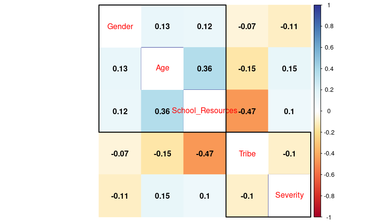

# correlation between GAD scores and demographic attributes

by F Njakai

[LinkedIn][def] | [Github][def2]

## Findings
### general
* 27.2% of respondents have minimal GAD; 35.4% have mild, 24.9% have moderate and 12.5% have severe GAD
* majority of respondents are from rich and medium-resource schools; 42.4% rich, 32.2% medium and 25.4% poor
* an overwhelming majority of respondents are of age 14-19, inclusive; they account for 88% of respondents
* respondents are almost evenly split with regard to gender; 48.6% of respondents are male, 51.4% are female
* _c._ two of every three respondents is from a minority tribe; 65.5% minority, 34.5% majority
### severity against select demographics
#### severity and age
* across all severity levels, respondents aged 14-17, inclusive, are the overwhelming majority. respondents aged 14-19, inclusive, account for 88% of respondents, therefore, it is reasonable that, statistically, the 14-17 group has the observations it exhibits

    |severity|proportion aged 14-17 (%)|
    |:---:|:---:|
    |minimal|89.4|
    |mild|89.2|
    |moderate|86.6|
    |severe|84.2|

* the age range across severity levels viz

    |severity|age range|
    |:---:|:---:|
    |minimal|12-21|
    |mild|13-23|
    |moderate|13-19|
    |severe|13-25|

    notice how the respondents under `moderate` severity are strictly teenagers
#### severity and gender
* male respondents make a majority in the severity levels `minimal` and `mild` and a minority in the levels `moderate` and `severe`

    |severity|%female|%male|
    |:---:|:---:|:---:|
    |minimal|49.4|50.6|
    |mild|46.4|53.6|
    |moderate|51.8|48.2|
    |severe|67.1|32.9|

    the differences between genders in the groups where males are in the majority is smaller than those where the females are in the majority
#### severity and tribe
* respndents from minority tribe(s) make a majority across all severity levels; the differences between tribes is large

    |severity|%majority|%minority|
    |:---:|:---:|:---:|
    |minimal|33.5|66.5|
    |mild|42.5|57.5|
    |moderate|29.3|70.7|
    |severe|30.5|69.5|

#### severity and school resources
* respondents from less-resourced schools make a majority of respondents in each severity level; 52% of those that reported minimal and 46.3% of those that reported severe GAD levels are from poor schools

    |severity|%rich|%medium|%poor|
    |:---:|:---:|:---:|:---:|
    |minimal|30.7|17.3|52.0|
    |mild|34.8|25.8|39.5|
    |moderate|32.9|32.9|34.1|
    |severe|26.8|26.8|46.3|

* in the `moderate` and `severe` levels, there are as many respondents from resource-rich schools as those from schools with medium resources: 32.9% unser `moderate`  and 26.8% under `severe`

#### severity and all demographic characteristics
* there is weak correlation between severity and all demographic characteristics
  
    ||Tribe|Gender|Age|School_Resources|Severity|
    |:---:|:---:|:---:|:---:|:---:|:---:| 
    |Tribe           | 1.00000000|-0.06649228|-0.1547092|-0.4697763|-0.09551923|
    |Gender          |-0.06649228| 1.00000000| 0.1310904| 0.1225617|-0.10956822|
    |Age             |-0.15470924| 0.13109041| 1.0000000| 0.3646377| 0.14902258|
    |School_Resources|-0.46977631| 0.12256171| 0.3646377| 1.0000000| 0.10230336|
    |Severity        |-0.09551923|-0.10956822| 0.1490226| 0.1023034| 1.00000000|

* the most positive is age (0.15) and the most negative is gender (-0.11)
    * to some extent, the older a respondent is the more likely it to have more severe GAD

## About GAD
### what is GAD?
* GAD is a long-term condition that causes a patientto feel anxious about a wide range of situations and issues rather than one specific event
* People with GAD feel anxious most days and often struggle to remember the last time they felt relaxed
* As soon as one anxious thought is resolved, another may appear about a different issue
### what does the GAD score measure?
* One's proclivity to have excessive, uncontrollable and often irrational worry about events or activities
### why is GAD important as a measure of mental wellness?
* It is an efficient tool for screening for GAD and assessing its severity in clinical practice and research
## Method
### flow
* consume dataset
* clean dataset
* perform simple EDA
* create a correlogram of severity levels against demographic characteristics
* create an abstract
## Data set
* 658 variables of 33 observations
### missing values
* the data-set is imputed, therefore, there are no missing values
### imputed data-set
* not able to determine what type of imputation has been used
## Sources
1. [Datrtmouth-Hitchcock][def3]
2. [Brief measures][def4]
3. [MIRECC][def5]
4. [NHS - UK][def6]
5. [NIMH - US][def7]
6. [AAFP - US][def8]
7. [NLM - US][def9]

## Visualisations

## Tables

1. Occurrence of GAD by severity

|Severity|Freq|Percentage|
|:---:|:---:|:---:|
|Mild|233|35.4|
|Minimal|179|27.2|
|Moderate|164|24.9|
|Severe|82|12.5|

2. Occurrence of GAD by school resources

|School_Resources|Freq|Percentage|
|:---:|:---:|:---:|
|Medium|212|32.2|
|Poor|167|25.4|
|Rich|279|42.4|

3. Occurrence of GAD by age

|Age|Freq|Percentage|
|:---:|:---:|:---:|
|12|  1| 0.152|
|13| 13| 1.98 |
|14| 84|12.8  |
|15|179|27.2  |
|16|199|30.2  |
|17|117|17.8  |
|18| 42| 6.38 |
|19| 15| 2.28 |
|20|  3| 0.456|
|20|  1| 0.152|
|21|  1| 0.152|
|22|  1| 0.152|
|23|  1| 0.152|
|25|  1| 0.152|

4. Occurrence of GAD by gender

|Gender|Freq|Percentage|
|:---:|:---:|:---:|
|F|338|51.4|
|M|320|48.6|

5. Occurrence of GAD by tribe

|Tribe|Freq|Percentage|
|:---:|:---:|:---:|
|Majority|227|34.5|
|Minority|431|65.5|

6. Occurrence of GAD by age, grouped by severity

|Severity|Age|Freq|Percentage|
|:---:|:---:|:---:|:---:|
|Mild   |13| 4| 1.72 |
|Mild   |14|24|10.3  |
|Mild   |15|63|27.0  |
|Mild   |16|72|30.9  |
|Mild   |17|49|21.0  |
|Mild   |18|14| 6.01 |
|Mild   |19| 4| 1.72 |
|Mild   |20| 2| 0.858|
|Mild   |23| 1| 0.429|
|Minimal|12| 1| 0.559|
|Minimal |13  | 7| 3.91 |
|Minimal |14  |31|17.3  |
|Minimal |15  |52|29.1  |
|Minimal |16  |53|29.6  |
|Minimal |17  |24|13.4  |
|Minimal |18  | 7| 3.91 |
|Minimal |19  | 2| 1.12 |
|Minimal |20.5| 1| 0.559|
|Minimal |21  | 1| 0.559|
|Moderate|13  | 1| 0.610|
|Moderate|14  |21|12.8  |
|Moderate|15  |49|29.9  |
|Moderate|16  |46|28.0  |
|Moderate|17  |26|15.9  |
|Moderate|18  |15| 9.15 |
|Moderate|19  | 6| 3.66 |
|Severe  |13  | 1| 1.22 |
|Severe  |14  | 8| 9.76 |
|Severe  |15  |15|18.3  |
|Severe  |16  |28|34.1  |
|Severe  |17  |18|22.0  |
|Severe  |18  | 6| 7.32 |
|Severe  |19  | 3| 3.66 |
|Severe  |20  | 1| 1.22 |
|Severe  |22  | 1| 1.22 |
|Severe  |25  | 1| 1.22 |

7. Occurrence of GAD by gender, grouped by severity

|Severity|Gender|Freq|Percentage|
|:---:|:---:|:---:|:---:|
|Mild    |F|115|49.4|
|Mild    |M|118|50.6|
|Minimal |F| 83|46.4|
|Minimal |M| 96|53.6|
|Moderate|F| 85|51.8|
|Moderate|M| 79|48.2|
|Severe  |F| 55|67.1|
|Severe  |M| 27|32.9|

8. Occurrence of GAD by tribe, grouped by severity

|Severity|Tribe|Freq|Percentage|
|:---:|:---:|:---:|:---:|
|Mild    |Majority| 78|33.5|
|Mild    |Minority|155|66.5|
|Minimal |Majority| 76|42.5|
|Minimal |Minority|103|57.5|
|Moderate|Majority| 48|29.3|
|Moderate|Minority|116|70.7|
|Severe  |Majority| 25|30.5|
|Severe  |Minority| 57|69.5|

9. Occurrence of GAD by school resources, grouped by severity

|Severity|School_Resources|Freq|Percentage|
|:---:|:---:|:---:|:---:|
|Mild    |Medium|81|34.8|
|Mild    |Poor  |60|25.8|
|Mild    |Rich  |92|39.5|
|Minimal |Medium|55|30.7|
|Minimal |Poor  |31|17.3|
|Minimal |Rich  |93|52.0|
|Moderate|Medium|54|32.9|
|Moderate|Poor  |54|32.9|
|Moderate|Rich  |56|34.1|
|Severe  |Medium|22|26.8|
|Severe  |Poor  |22|26.8|
|Severe  |Rich  |38|46.3|

[def]: https://www.linkedin.com/in/fnjakai
[def2]: https://www.github.com/brk-a
[def3]: https://www.dartmouth-hitchcock.org/sites/default/files/2021-02/gad-7-anxiety-scale.pdf
[def4]: https://briefmeasures.org/gad-7-scale-and-scoring.html
[def5]: https://www.mirecc.va.gov/cih-visn2/Documents/Clinical/GAD_with_Info_Sheet.pdf
[def6]: https://www.nhs.uk/mental-health/conditions/generalised-anxiety-disorder/overview/
[def7]: https://www.nimh.nih.gov/health/statistics/generalized-anxiety-disorder
[def8]: https://www.aafp.org/pubs/afp/issues/2009/0501/p785.html
[def9]: https://www.ncbi.nlm.nih.gov/pmc/articles/PMC5542568/